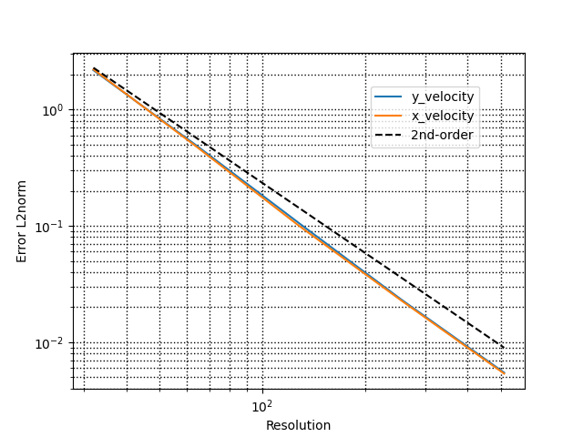

# PeleLMeX ConvergenceTests

The following 

## Advection scheme

### Convected vortex:

The convection of an isetropic vortex in a periodic box is a classical test case for 
the velocity advection scheme. The solution of the Euler equation after the vortex
circulated *n* times in the box is the initial solution, providing an easy estimate
of the error.

### Convected Gaussian of scalars:

The convection of a smooth scalar profile (species or temperature) by a uniform, constant velocity
is a simple test case enabling verification of the behavior of the advection scheme.
Once again, in the asbence of scalar diffusion, the analytical solution is provided by the initial
solution.

## Diffusion scheme
